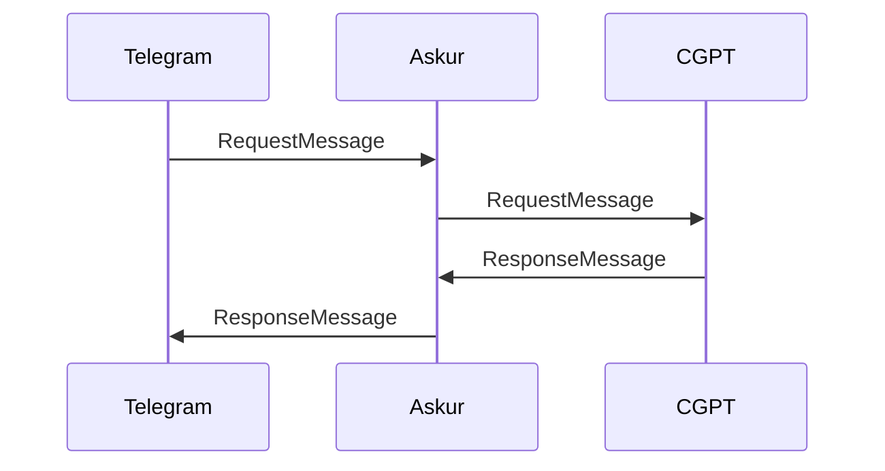

# Askur
Askur is a service registry for bot capabilities. It is designed to be the central core of an EI (Extended Intelligence) system. Separate services can register themselves as a capability.The system can then make use of askur to forward user requests to the appropriate service. 

All services implement a `/health` endpoint and take in a `RequestMessage` and return a `ResponseMessage`. This universal interface allows for infinite extensibility while the registry allows for easy discovery of new capabilities.

Below is a diagram of how system registry would work.

Below is a scenario where a telegram bot sends a `RequestMessage` to Askur. Askur then forwards the request to the appropriate capability. The capability then returns a `ResponseMessage` to Askur which is then forwarded to the telegram bot.

